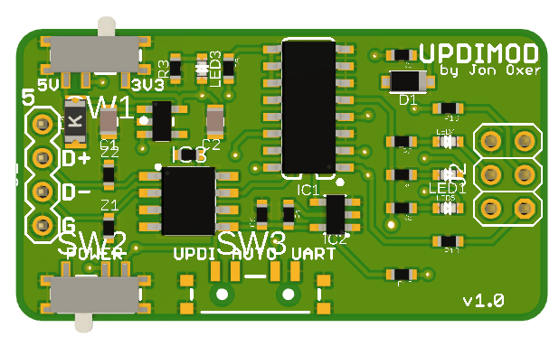
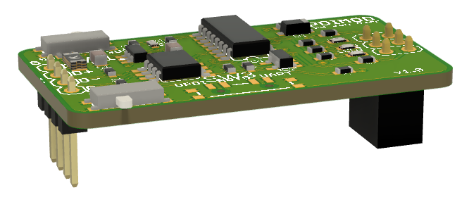

UPDI Programmer / Serial Module
===============================

Copyright 2025 SuperHouse Automation Pty Ltd  [www.superhouse.tv]()

UPDI programmer and USB-serial converter with support for automatic mode switching, 
so that a single USB connection can be used to flash, debug, and communicate with a 
target device.

This module is functionally equivalent to the excellent SerialUPDI programmer 
designed and sold by MCUdude. I'm a big fan of MCUdude's work and I've bought quite 
a few of his programmers. If you want a programmer with a USB socket that you can 
use simply by plugging it into your computer, buy his devices instead! You can get 
them here:

[www.tindie.com/products/mcudude/serialupdi-programmer/](https://www.tindie.com/products/mcudude/serialupdi-programmer/)

You should also check out MCUdude's Arduino cores that are compatible with this 
programmer, including:

 * [MegaCoreX](https://github.com/MCUdude/MegaCoreX)
 * [DxCore](https://github.com/SpenceKonde/DxCore)
 * [megaTinyCore](https://github.com/SpenceKonde/megaTinyCore)

So why does this module exist? Simply as a more convenient way to add the functionality 
of the SerialUPDI to a carrier PCB, without needing a USB cable.

Specifically, this module was designed as a building block for rapidly creating Test 
Modules for the [Testomatic PCB Test Jig System](https://github.com/superhouse/testomatic). 
It allows the tester to program and debug a target Device Under Test via UPDI, and 
communicate with it via serial UART.

However, there is nothing specific about Testomatic in this module so it can be used 
for any project that requires a UPDI programmer with serial comms.

## Features

* CH340N USB-to-serial converter
* Single-wire UPDI interface
* Selectable output voltage of 5V or 3.3V
* Switchable output power
* Serial mode, UPDI mode, or auto mode

## Pinout

The left side of the module has a 4-way header for power and USB:

* 1: 5V from host board
* 2: USB D+
* 3: USB D-
* 4: GND

The right side of the module has a 6-way header in the same format as the SerialUPDI 
programmer:

 * 1: UPDI
 * 2: VTARGET (switchable)
 * 3: RTS (not connected: can be bridged)
 * 4: TXD
 * 5: RXD
 * 6: GND

## Installation
Schematic and PCB were created in Fusion360 and provided as a Fusion360 project. They 
are also exported as EAGLE format, which can be imported back into Fusion360 or various 
other packages including KiCAD.

## Credits
Designed by Jonathan Oxer <jon@oxer.com.au>.

## Distribution
The specific terms of distribution of this project are governed by the
license referenced below.

## License
Licensed under the TAPR Open Hardware License (www.tapr.org/OHL).
The "license" folder within this repository also contains a copy of
this license in plain text format.
